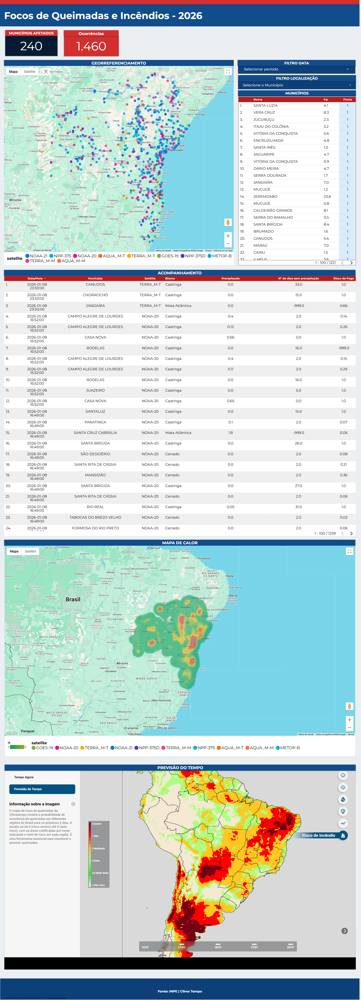
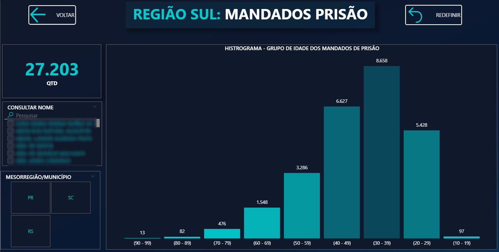
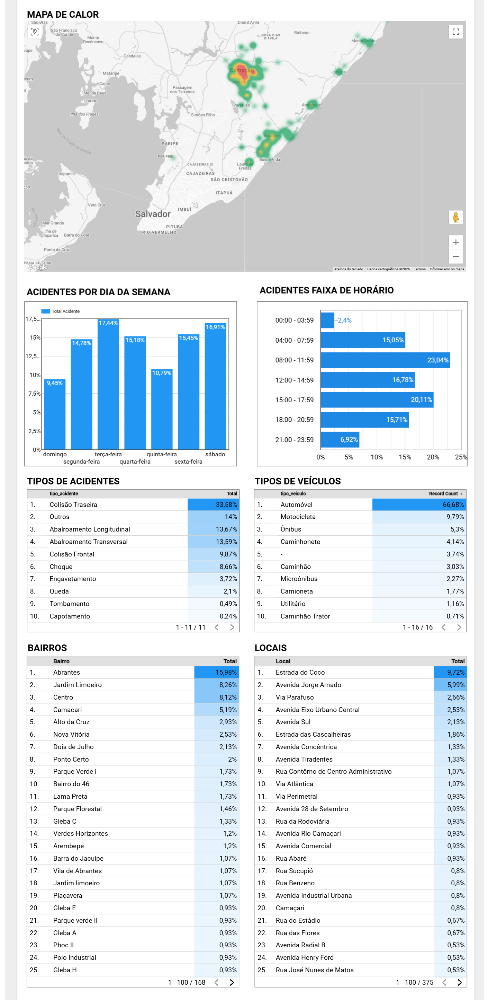

# Real-time Fuel Price Monitoring (Bahia, Brazil) — Web Scraping + Databricks + FastAPI

This repository is a **full end-to-end case study** showing how to monitor fuel prices in near real time for a Brazilian state — **Bahia (BA)** — using an open data source, web scraping (because there is no public API), and a modern analytics stack on Databricks, finished with a FastAPI layer for consumption by apps and dashboards.

Data source: **Preço da Hora (Bahia Government)**

- Website: https://precodahora.ba.gov.br/
- The site displays fuel prices with near-instant updates based on issued electronic invoices.

> Even though this case uses an open website, the same approach can be adapted to authenticated systems by reproducing browser sessions securely.

---

## Why Web Scraping?

The website does **not provide an official public API**.
To access the data programmatically we implemented a scraping collector that reproduces the website network calls without Selenium.

Key challenge: the target endpoint requires:

- a valid session (cookies)
- a signed CSRF token sent in the `X-CSRFToken` header

Without those, the server responds with **401 Unauthorized**.

---

## Approach Overview

### 1) Reverse engineering the website calls

We mapped the real request used by the website (e.g. `/produtos/`) and confirmed:

- the endpoint depends on a valid session
- CSRF must be extracted and sent in requests

### 2) Bootstrap step (no Selenium)

We implemented a **bootstrap GET** request that:

- captures cookies (`session`, token, etc.)
- extracts the CSRF token from HTML/JS
- reproduces the same browser behavior using plain `requests`

### 3) Python collector (authenticated POST)

We built a collector that:

- performs authenticated POST requests using cookies + `X-CSRFToken`
- handles **rate limiting (HTTP 429)** with backoff/retry
- runs in “case mode”, collecting **1 page per fuel type**:
  - GASOLINA, ETANOL, DIESEL, GNV

### 4) Raw output and audit artifacts

Scraped results are saved as **JSON Lines (`.jsonl`)** including execution metadata:

- `run_id`
- `collected_at_utc`
- query parameters (fuel type, radius, page, etc.)

We also generate:

- `manifest.json` (collection summary)
- logs for auditing and pipeline validation before Databricks ingestion

> In this case study, raw files were uploaded manually to speed up the demo, but in production they should be stored in a bucket (S3/Azure/GCS) and read directly by Databricks.

---

## Databricks Pipeline (Bronze → Silver → Gold)

We implemented a complete ingestion + transformation pipeline for analytics and APIs.

### Unity Catalog Volume

A Volume was created to store raw files:

- `/Volumes/workspace/default/teste`

### Bronze — Raw ingestion

We read the JSONL files (one page per fuel type) and wrote a raw Delta table:

- `precodahora.bronze_raw`

Goal:

- keep the **raw data** for auditing and reprocessing

### Silver — Flattened, typed dataset

We transformed Bronze into Silver:

- `precodahora.silver_prices`

Actions:

- flatten JSON (product + station + query parameters)
- type fields (price, timestamp, lat/lng, etc.)
- prepare data for fast queries

### Validation

We validated Silver using:

- min/max price checks
- counts per fuel type
- sanity checks for timestamps and coordinates

### Gold — Consumption-ready layer

We created Gold objects for consumption:

- `precodahora.gold_latest` — latest price per station/product
- time series base for price evolution (for charts and analytics)

These are used by:

- FastAPI endpoints
- dashboards (Looker/Power BI/etc.)

[Open Full Config](img/data_full.png)

---

## FastAPI Layer (Databricks SQL → REST)

We built a simple FastAPI project to expose the curated Gold/Silver data through HTTP endpoints.

### API Endpoints (Summary)

**Health**

- `GET /health` — API health
- `GET /health/db` — Databricks connectivity check (`SELECT 1`)

**Metadata**

- `GET /meta/fuel-types` — available fuel types
- `GET /meta/cities?uf=BA` — available cities (optional UF filter)

**Latest Prices**

- `GET /latest` — latest prices (pagination, sorting)
- `GET /prices/latest` — alias for `/latest`
- `GET /prices/nearby` — nearby prices by radius (Haversine)
- `GET /prices/best` — cheapest ranking by fuel type/city/UF
- `GET /prices/compare` — avg/min/max summary for a location

**Stations**

- `GET /stations/search` — search stations by name/city/UF
- `GET /stations/{cnpj}` — station detail + latest fuels/prices

**Time Series**

- `GET /timeseries` — daily aggregated series (avg/min/max)
- `GET /timeseries/city` — daily series by city/UF
- `GET /timeseries/station` — station-level events by CNPJ

**Ops / Insights**

- `GET /stats/summary` — operational dataset summary
- `GET /alerts/price-drop` — detects significant price drops
- `GET /anomalies` — detects outliers using z-score

---

## Next Steps / Production Improvements

- Run the scraping collector on a scheduler (Airflow, Databricks Jobs, GitHub Actions, etc.)
- Store raw output in object storage (S3/Azure/GCS) instead of manual upload
- Add incremental ingestion (watermark) and deduplication strategy
- Add caching in FastAPI for frequently accessed endpoints
- Add authentication and per-user quotas/rate limits for API usage

---

## Disclaimer

This repository is for educational and engineering case study purposes.
Always ensure compliance with website terms, local laws, and data policies when scraping.

---

## Technical Interview Notes

### 1) Can you describe an API you developed that consumed analytical or market data?

This repository contains an end-to-end FastAPI project that I developed and published as a complete case study. The API exposes near real-time fuel price data (GASOLINA/ETHANOL/DIESEL/GNV) for Bahia, Brazil. The source is the official “Preço da Hora” website, which updates prices based on electronic invoices, but it **doesn’t provide a public API**.

To address that, I implemented a Python collector that reproduces browser behavior (session cookies + CSRF token), performs authenticated POST requests, and outputs JSONL with execution metadata (`run_id`, `collected_at_utc`, query parameters).

On Databricks, I implemented the full analytics pipeline using a layered approach:

- **Bronze**: raw ingestion for auditing and reprocessing
- **Silver**: flattened and typed dataset (timestamps, geolocation, station/product fields)
- **Gold**: consumption views such as “latest price per station/product” and time-series aggregates

The FastAPI service queries primarily the **Gold** layer to deliver stable, analytics-ready endpoints such as `/latest`, `/timeseries`, `/prices/nearby`, and `/prices/best`, enabling downstream apps and dashboards to consume curated data consistently.

### 2) How do you implement pagination, filtering, and validation in FastAPI?

I implement this in three layers:

- **Input validation (FastAPI + Query constraints)**

  - `page`/`page_size` with bounds (`ge`, `le`)
  - strict validation for `order_dir` (`asc`/`desc`)
  - date range validation (`date_from`, `date_to`)
  - allowed values validation (e.g., fuel types)
- **Safe query construction**

  - no raw SQL concatenation with user input
  - filters are parameterized
  - `order_by` uses a whitelist (e.g., `price_unit`, `price_ts`, `distance_km`) to prevent SQL injection
- **Pagination strategy**

  - default: `LIMIT/OFFSET` with metadata (`page`, `page_size`, `total`)
  - for high volume: prefer **keyset pagination** (cursor-based) using stable fields (`price_ts + cnpj + product_code`)

### 3) What is your approach to handling slow queries or high-volume requests in APIs?

- enforce max limits (`page_size`, date range)
- short-TTL caching (e.g., Redis) for hot endpoints like `/latest`
- rate limiting per IP/key
- optimize the analytical layer (Gold views/materializations, pushdown filters)
- run blocking DB calls in threadpool/workers when needed
- observability: query timing logs + p95/p99 tracking + slow query alerts

### 4) How do you structure automated tests for backend endpoints?

Using `pytest` + FastAPI `TestClient`:

- **Unit tests**: validation, SQL builders, business rules
- **Integration tests**: endpoint → repository layer (mock DB or test environment)
- **Contract/regression tests**: schema stability + known fixtures for min/max/avg correctness

Examples:

- invalid params return 422 (`page=0`, invalid `order_by`)
- pagination metadata correctness
- response schema invariants (timestamps ISO, prices numeric)

### 5) Describe how you connect an API to Snowflake or another analytical database.

I use official drivers + environment-based configs + repository pattern.

- **Snowflake**

  - `snowflake-connector-python` or SQLAlchemy
  - auth via password / key-pair / SSO (client dependent)
  - set role/warehouse/database/schema per environment
  - connection pooling via SQLAlchemy for throughput
  - parameterized queries + ordering whitelist
- **Databricks (this case)**

  - `databricks-sql-connector` with `server_hostname`, `http_path`, `access_token`
  - a `querydb()` wrapper standardizes params and responses

Migration is straightforward: keep endpoints and swap the repository to target Snowflake Gold tables/views.

### 6) Tell me about a dashboard you built that required complex interactions or charts.

I’ve built operational and analytical dashboards for public-sector use cases that required heavy interactivity and multiple chart types. Two good examples are: (1) a Traffic Accident dashboard (DAT) for a municipal agency and (2) a Wildfire/Fires dashboard combining INPE hotspot data with fire-risk layers.

Key features included:

- **Cascading filters** (e.g., Year → Month → UF → City → District/Location → Fuel type / Accident type / Satellite source)
- **KPI cards** that update instantly with filters (totals, YoY comparisons, min/avg/max, top locations)
- **Time-series charts** for trend analysis (monthly evolution, daily aggregations, seasonality)
- **Ranking tables** (top neighborhoods/streets for accidents; top municipalities for hotspots; cheapest stations for fuel), with sorting and pagination
- **Interactive maps** with clustering/heatmaps, plus drill-down (clicking points/rows focuses the map and opens detailed records/history)
- **Multi-layer geospatial visualization** (hotspots + heatmap + satellite layers + fire-risk overlays)
- **Performance optimizations** for high-volume data (pre-aggregations, caching, incremental loading, table virtualization)

In the fuel price case study, the dashboard is backed by a Databricks layered model:

- **`gold_latest`** to power “current price” rankings and latest KPIs
- **time-series aggregates** (from Silver/Gold) to drive trend charts reliably and consistently

### 7) How do you guarantee UI accuracy when rendering data from multiple API endpoints?

- consistent schemas/types across endpoints (prices numeric, timestamps ISO)
- single source of truth: dashboards consume **Gold layer** rules
- avoid “joining in the frontend” when it risks inconsistency; prefer backend aggregation/join
- consistency checks: KPI cards must match table aggregations for same filters
- version endpoints when contracts change

### 8) How do you handle state management in React for dashboards (React Query or similar)?

- **Server state**: React Query/TanStack Query
  - cache keys include filters: `['latest', fuel, uf, city, page]`
  - `keepPreviousData` for smooth pagination
  - `staleTime` + `refetchInterval` for near real-time
  - prefetch next page
- **UI state**: `useState/useReducer` or Zustand (filters, modals, selections)

### 9) Describe a situation where you optimized a UI that was rendering too slowly.

Typical improvements:

- reduce payload (only necessary columns)
- server-side pagination/sorting
- table virtualization (react-window / TanStack Virtual)
- debounce text filters
- memoization to prevent re-render cascades
- move heavy aggregation to backend (Gold/SQL)
- leverage React Query caching to avoid redundant refetch

### 10) How do you validate that a dashboard correctly reflects business rules and calculations?

- define rules explicitly (e.g., “latest per station/product = most recent record within filters”)
- implement rules in **Gold (SQL)** for auditability and reproducibility
- automated tests with known fixtures
- cross-check UI consistency:
  - KPI = aggregation of table for same filter set
  - chart min/max matches backend aggregate
- logs and lineage (`run_id`, timestamps) for traceability

---

## Selected Dashboard Examples (Public/Shareable Samples)

Below are a few representative dashboard examples. Many other dashboards I’ve built cannot be shared publicly because they contain sensitive or restricted data. In other cases, I no longer have access to the environments after project handoff, specifically due to confidentiality and access control policies.

