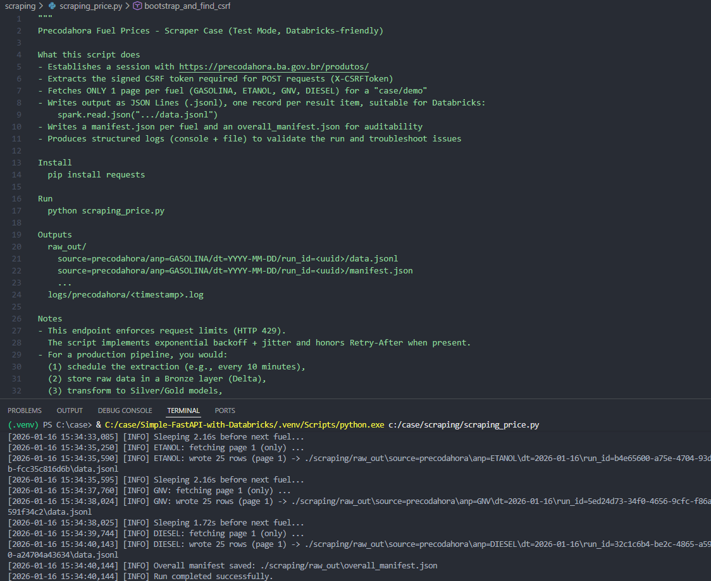
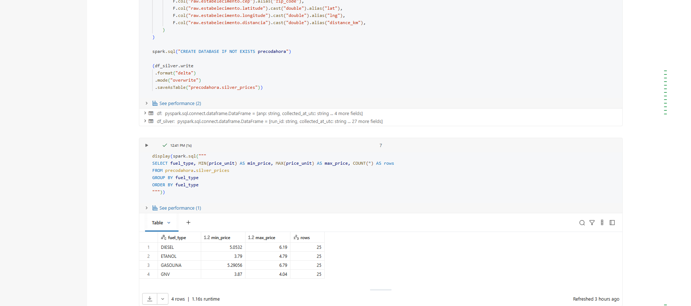
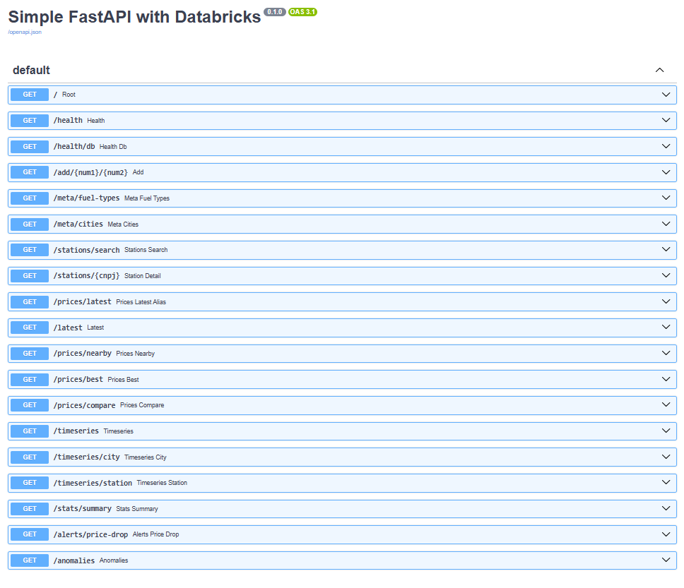
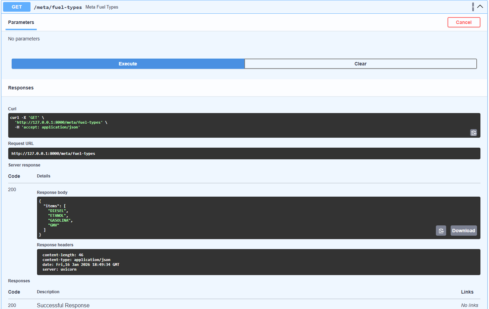
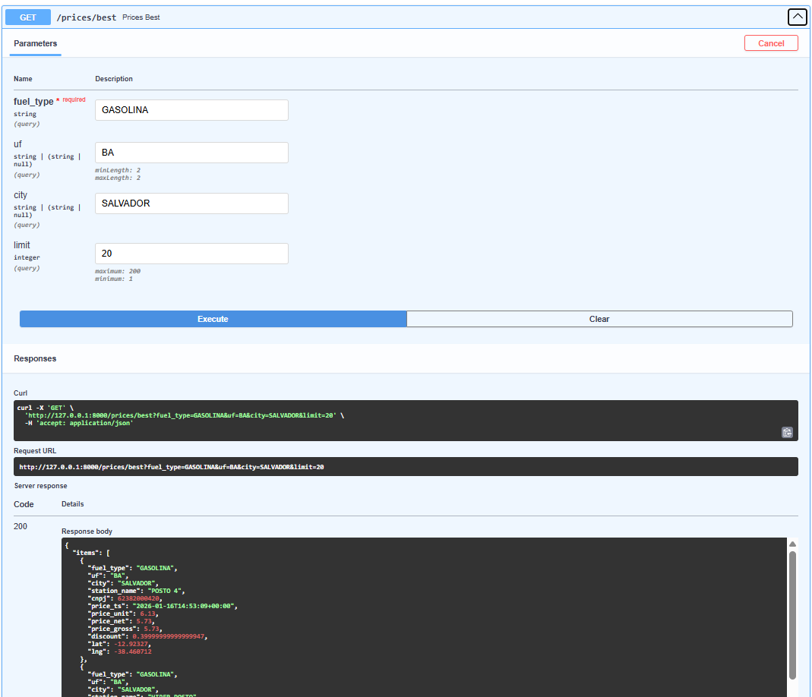

# Real-time Fuel Price Monitoring (Bahia, Brazil) — Web Scraping + Databricks + FastAPI

This repository is a **full end-to-end case study** showing how to monitor fuel prices in near real time for a Brazilian state — **Bahia (BA)** — using an open data source, web scraping (because there is no public API), and a modern analytics stack on Databricks, finished with a FastAPI layer for consumption by apps and dashboards.

Data source: **Preço da Hora (Bahia Government)**

- Website: https://precodahora.ba.gov.br/
- The site displays fuel prices with near-instant updates based on issued electronic invoices.

> Even though this case uses an open website, the same approach can be adapted to authenticated systems by reproducing browser sessions securely.

---

## Why Web Scraping?

The website does **not provide an official public API**.
To access the data programmatically we implemented a scraping collector that reproduces the website network calls without Selenium.

Key challenge: the target endpoint requires:

- a valid session (cookies)
- a signed CSRF token sent in the `X-CSRFToken` header

Without those, the server responds with **401 Unauthorized**.

---

## Approach Overview

### 1) Reverse engineering the website calls

We mapped the real request used by the website (e.g. `/produtos/`) and confirmed:

- the endpoint depends on a valid session
- CSRF must be extracted and sent in requests

### 2) Bootstrap step (no Selenium)

We implemented a **bootstrap GET** request that:

- captures cookies (`session`, token, etc.)
- extracts the CSRF token from HTML/JS
- reproduces the same browser behavior using plain `requests`

### 3) Python collector (authenticated POST)

We built a collector that:

- performs authenticated POST requests using cookies + `X-CSRFToken`
- handles **rate limiting (HTTP 429)** with backoff/retry
- runs in “case mode”, collecting **1 page per fuel type**:
  - GASOLINA, ETANOL, DIESEL, GNV

### 4) Raw output and audit artifacts

Scraped results are saved as **JSON Lines (`.jsonl`)** including execution metadata:

- `run_id`
- `collected_at_utc`
- query parameters (fuel type, radius, page, etc.)

We also generate:

- `manifest.json` (collection summary)
- logs for auditing and pipeline validation before Databricks ingestion

> In this case study, raw files were uploaded manually to speed up the demo, but in production they should be stored in a bucket (S3/Azure/GCS) and read directly by Databricks.

---

## Databricks Pipeline (Bronze → Silver → Gold)

We implemented a complete ingestion + transformation pipeline for analytics and APIs.

### Unity Catalog Volume

A Volume was created to store raw files:

- `/Volumes/workspace/default/teste`

### Bronze — Raw ingestion

We read the JSONL files (one page per fuel type) and wrote a raw Delta table:

- `precodahora.bronze_raw`

Goal:

- keep the **raw data** for auditing and reprocessing

### Silver — Flattened, typed dataset

We transformed Bronze into Silver:

- `precodahora.silver_prices`

Actions:

- flatten JSON (product + station + query parameters)
- type fields (price, timestamp, lat/lng, etc.)
- prepare data for fast queries

### Validation

We validated Silver using:

- min/max price checks
- counts per fuel type
- sanity checks for timestamps and coordinates

### Gold — Consumption-ready layer

We created Gold objects for consumption:

- `precodahora.gold_latest` — latest price per station/product
- time series base for price evolution (for charts and analytics)

These are used by:

- FastAPI endpoints
- dashboards (Looker/Power BI/etc.)

[Open Full Config](img/data_full.png)

---

## FastAPI Layer (Databricks SQL → REST)

We built a simple FastAPI project to expose the curated Gold/Silver data through HTTP endpoints.

### API Endpoints (Summary)

**Health**

- `GET /health` — API health
- `GET /health/db` — Databricks connectivity check (`SELECT 1`)

**Metadata**

- `GET /meta/fuel-types` — available fuel types
- `GET /meta/cities?uf=BA` — available cities (optional UF filter)

**Latest Prices**

- `GET /latest` — latest prices (pagination, sorting)
- `GET /prices/latest` — alias for `/latest`
- `GET /prices/nearby` — nearby prices by radius (Haversine)
- `GET /prices/best` — cheapest ranking by fuel type/city/UF
- `GET /prices/compare` — avg/min/max summary for a location

**Stations**

- `GET /stations/search` — search stations by name/city/UF
- `GET /stations/{cnpj}` — station detail + latest fuels/prices

**Time Series**

- `GET /timeseries` — daily aggregated series (avg/min/max)
- `GET /timeseries/city` — daily series by city/UF
- `GET /timeseries/station` — station-level events by CNPJ

**Ops / Insights**

- `GET /stats/summary` — operational dataset summary
- `GET /alerts/price-drop` — detects significant price drops
- `GET /anomalies` — detects outliers using z-score

---

## Next Steps / Production Improvements

- Run the scraping collector on a scheduler (Airflow, Databricks Jobs, GitHub Actions, etc.)
- Store raw output in object storage (S3/Azure/GCS) instead of manual upload
- Add incremental ingestion (watermark) and deduplication strategy
- Add caching in FastAPI for frequently accessed endpoints
- Add authentication and per-user quotas/rate limits for API usage

---

## Disclaimer

This repository is for educational and engineering case study purposes.
Always ensure compliance with website terms, local laws, and data policies when scraping.
